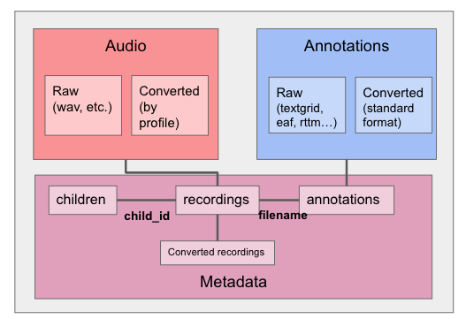

ChildProject
============
[](https://pypi.org/project/childproject/)
[](https://github.com/LAAC-LSCP/ChildProject/actions/workflows/tests.yml)
[](https://app.travis-ci.com/LAAC-LSCP/ChildProject)
[](https://childproject.readthedocs.io/en/latest/)
[](https://github.com/LAAC-LSCP/ChildProject/blob/master/LICENSE)


- [Introduction](#introduction)
- [Available tools](#available-tools)
- [Installation](#installation)

Introduction
------------

Day-long (audio-)recordings of children are increasingly common, but
there is no scientific standard formatting that can benefit the
organization and analyses of such data. ChildProject provides
standardizing specifications and tools for the storage and management of
day-long recordings of children and their associated meta-data and
annotations.



We assume that the data include three very different types:

1.  Audio, of which we distinguish the raw audio extracted from the
    hardware; and a version that has been converted into a standardized
    format. These audios are the long-form ones. At the time being, we
    do not foresee including clips extracted from these long-form
    audios, and assume that any such process will generate some form of
    annotation that can then be re-cast temporally to the long-form
    audio.
2.  Annotations, of which we again distinguish raw and standardized
    versions. At present, we can import from Praat\'s textgrid, ELAN\'s
    eaf, and VTC\'s rttm format.
3.  Metadata corresponding to the children, recordings, and annotations,
    which will therefore also describe the converted recordings.

Available tools
---------------

Day-long audiorecordings are often collected using a LENA recorder, and
analyzed with the LENA software. However, open source alternatives to
the LENA commercial environment are emerging, some of which are shown in
the following figure.


For instance, alternative hardware includes the babylogger and any other
light-weight recording device with enough battery and storage to record
over several hours.

Alternative automated analysis options include the [Voice Type
Classifier](https://github.com/MarvinLvn/voice-type-classifier),
which segments the audio into different talker types (key child, female
adult, etc) and [ALICE](https://github.com/orasanen/ALICE), an automated
linguistic unit counter.

As for manual annotation options,
[ELAN](https://archive.mpi.nl/tla/elan) can be used, for instance
employing the [ACLEW DAS annotation scheme](https://osf.io/b2jep/).
Assignment of annotation to individuals and evaluation can be done using
[Seshat](https://github.com/bootphon/seshat). Finally,
[Zooniverse](https://zooniverse.org) can be used to crowd-source certain aspects
of the classification with the help of citizen scientists.

In this context, we provide tools and a procedure to:

-   Validate datasets (making sure that metadata, recordings and
    annotations are in the right place and format)
-   Convert your raw recordings into the desired format
-   Import annotations (from the LENA, ELAN, Praat, VTC/ALICE/VCM rttms, CHAT files) into a standardized format
-   Generate reliability metrics by comparing annotators (confusion matrices, agreement coefficients, pyannote metrics)
-   Extract metrics from the annotations (e.g. average vocalization rates, durations, etc.)
-   Sample segments of the recordings to annotate from a set of sampling
    algorithms
-   Add clips to an annotation pipeline in Zooniverse, and retrieve the
    ensuing annotations

These tools can be used both in [command-line](https://childproject.readthedocs.io/en/latest/tools.html) or from within your python code, by importing our [modules](https://childproject.readthedocs.io/en/latest/modules.html).

Installation
------------

You can find instructions to install and use our package in our [documentation](https://childproject.readthedocs.io/en/latest/install.html).

Citation
--------

If you are using this project for your research, please cite our [introductory paper](https://psyarxiv.com/w8trm):

```tex
@article{gautheron_rochat_cristia_2021,
    title={Managing, storing, and sharing long-form recordings and their annotations},
    url={https://link.springer.com/article/10.1007/s10579-022-09579-3},
    DOI={10.1007/s10579-022-09579-3},
    publisher={Springer},
    journal={Language Resources and Evaluation}
    author={Gautheron, Lucas and Rochat, Nicolas and Cristia, Alejandrina},
    year={2022},
    month={Feb}
}
```
