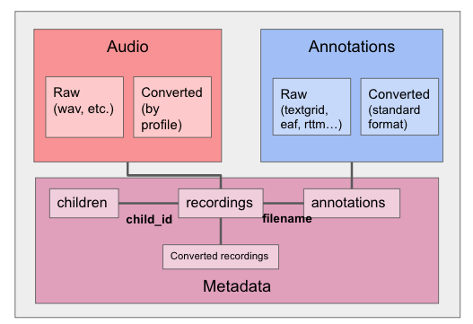

Introduction
------------

Day-long (audio-)recordings of children are increasingly common, but
there is no scientific standard formatting that can benefit the
organization and analyses of such data. ChildProject provides
standardizing specifications and tools for the storage and management of
day-long recordings of children and their associated meta-data and
annotations.

   File organization structure

We assume that the data include three very different types:

1. Audio, of which we distinguish the raw audio extracted from the
   hardware; and a version that has been converted into a standardized
   format. These audios are the long-form ones. At the time being, we do
   not foresee including clips extracted from these long-form audios,
   and assume that any such process will generate some form of
   annotation that can then be re-cast temporally to the long-form
   audio.
2. Annotations, of which we again distinguish raw and standardized
   versions. At present, we can import from Praat's textgrid, ELAN's
   eaf, and VTC's rttm format.
3. Metadata corresponding to the children, recordings, and annotations,
   which will therefore also describe the converted recordings.

Available tools
~~~~~~~~~~~~~~~

Day-long audiorecordings are often collected using a LENA recorder, and
analyzed with the LENA software. However, open source alternatives to
the LENA commercial environment are emerging, some of which are shown in
the following figure.

.. figure:: images/tools.png
   :alt: Overview of some tools in the day-long recordings environment

   Overview of some tools in the day-long recordings environment

For instance, alternative hardware includes the babylogger and any other
light-weight recording device with enough battery and storage to record
over several hours.

Alternative automated analysis options include the `Voice Type
Classifier <https://github.com/MarvinLvn/voice-type-classifier>`__,
which segments the audio into different talker types (key child, female
adult, etc) and `ALICE <https://github.com/orasanen/ALICE>`__, an
automated linguistic unit counter.

As for manual annotation options,
`ELAN <https://archive.mpi.nl/tla/elan>`__ can be used, for instance
employing the `ACLEW DAS annotation scheme <https://osf.io/b2jep/>`__;
`CHAT annotations <https://talkbank.org/manuals/CHAT.html>`__ are also supported.

Assignment of annotation to individuals and evaluation can be done using
`Seshat <https://github.com/bootphon/seshat>`__. Finally,
`Zooniverse <https://zooniverse.org>`__ can be used to crowd-source certain
aspects of the classification with the help of citizen scientists.

In this context, we provide tools and a procedure to:

-  Validate datasets (making sure that metadata, recordings and
   annotations are in the right place and format)
-  Convert your raw recordings into the desired format
-  Import annotations (from the LENA, ELAN, Praat, VTC/ALICE/VCM rttms, CHAT files)
   into a standardized format
-  Generate reliability metrics by comparing annotators
   (confusion matrices, agreement coefficients, pyannote metrics)
-  Extract metrics from the annotations (e.g. average vocalization rates, durations, etc.)
-  Sample segments of the recordings to annotate from a set of sampling
   algorithms
-  Add clips to an annotation pipeline in Zooniverse, and retrieve the
    ensuing annotations

(And more!)

Citing this work
~~~~~~~~~~~~~~~~

If you are using this project for your research, please cite our `introductory paper <https://psyarxiv.com/w8trm>`_:

.. code-block:: tex 

   @article{gautheron_rochat_cristia_2021,
      title={Managing, storing, and sharing long-form recordings and their annotations},
      url={https://link.springer.com/article/10.1007/s10579-022-09579-3},
      DOI={10.1007/s10579-022-09579-3},
      publisher={Springer},
      journal={Language Resources and Evaluation}
      author={Gautheron, Lucas and Rochat, Nicolas and Cristia, Alejandrina},
      year={2022},
      month={Feb}
   }

Community
~~~~~~~~~

 - You can ask for help, suggest ideas about the package or share code that relies on it with others on `GitHub discussions <https://github.com/LAAC-LSCP/ChildProject/discussions>`__.
 - Bugs should be reported on `GitHub <https://github.com/LAAC-LSCP/ChildProject/issues>`__ too.