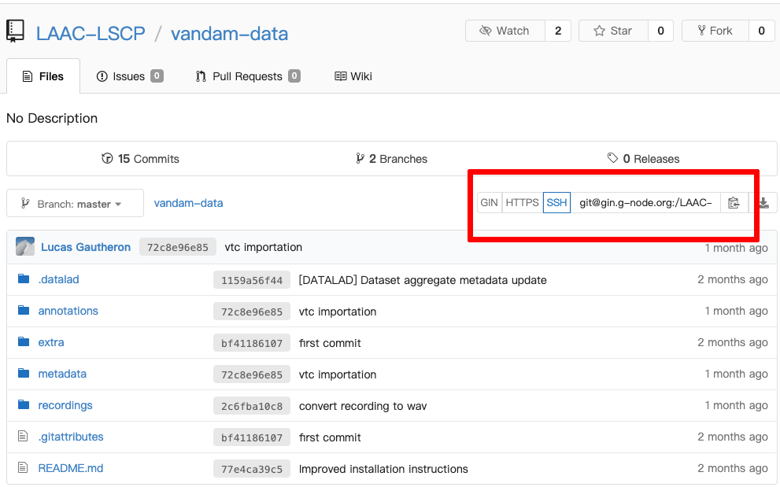

How to reuse GIN datasets
=========================

Our datasets are managed with `datalad <https://www.datalad.org/>`__. Datalad
allows the versioning and distribution of large datasets. Datalad relies
on another tool called
`git-annex <https://git-annex.branchable.com/>`__, which itself is an
extension of git providing support for large file versioning with a high
flexibility.

We host the data on `GIN <http://gin.g-node.org/>`__. GIN's interface
is really similar to GitHub, but unlike the latter, GIN can handle
our large files.

Installing datalad
------------------

The DataLad handbook provides extensive instructions for the
installation of DataLad in their `handbook <http://handbook.datalad.org/en/latest/intro/installation.html#install>`__.

If you have admin rights and you are working on Linux or Mac, the following
should work:

1. Install git-annex using ``apt install git-annex`` (linux) or
   ``brew install git-annex`` (mac). Git-annex is available by default
   on Oberon.
2. Install datalad with pip : ``pip3 install datalad``

.. note::
   
   If you are having permission issues, consider using python virtual
   environments or conda (see `DataLad's handbook <http://handbook.datalad.org/en/latest/intro/installation.html#install>`__).
   Otherwise, refer to your system administrator. 

Setup your GIN account
----------------------

Most repositories are private, and thus require authentication.
We recommend that you always use SSH authentication and we will only
provide instructions for this case.

Before anything, you will need to create an account on `GIN <https://gin.g-node.org/>`_,
and to link your `SSH public key <https://gin.g-node.org/user/settings/ssh>`_ to your
GIN account.

1. Create an account on GIN
2. Copy your SSH public key (usually located in ``~/.ssh/id_rsa.pub``)
3. Go to `GIN > Settings > SSH Keys <https://gin.g-node.org/user/settings/ssh>`__
4. Click on the blue button ‘Add a key’ and paste your public key
   where requested.

.. note::

   Remember to communicate your username to the data administrator
   before you try to access the data 
   in order for him to grant you permissions.

.. note::

   You can configure as many keys as necessary. This is useful when you
   need to access GIN from different locations with different SSH keys
   (e.g. from your lab cluster, or from your own laptop).

.. note::

   You may consider enabling the Keychain
   (append ``~/.ssh/config`` with ``UseKeychain yes``)
   if you are prompted for your SSH passphrase everytime.

Installing a dataset
~~~~~~~~~~~~~~~~~~~~

Installing a dataset can be done with the `datalad install` command.
The input is the SSH location of the dataset. It can be found on
the page of the repository on GIN:

   A GIN dataset.

For instance, the VanDam public dataset (available on `GIN <https://gin.g-node.org/LAAC-LSCP/vandam-data>`__)
can be installed with the following command:

.. code:: bash

   datalad install git@gin.g-node.org:/LAAC-LSCP/vandam-data.git
   cd vandam-data

Datasets that contain subdatasets can be installed recursively using the -r switch.
This is the case of the EL1000 dataset:

.. code:: bash

   datalad install git@gin.g-node.org:/EL1000/EL1000.git
   cd EL1000

.. warning::
   
   Some datasets may require additional configuration steps.
   Pay attention to the README before you start using a dataset. 

That’s it ! Your dataset is ready to go. By default, large files do not
get downloaded automatically. See the next section for help with
downloading those files.

Downloading large files
-----------------------

Files can be retrieved using ``datalad get [path]``. For instance,
``datalad get recordings`` will download all recordings.

.. note::

   Technically speaking, the large files in your repository are symbolic links
   pointing to their actual location, somewhere under `.git`.
   You can ignore that and read/copy the content of these files as if they where
   actual files.

.. warning::

   If you want to *edit* the content of a large file, you will need to unlock it
   beforehand, using ``datalad unlock``,
   e.g.: ``datalad unlock annotations/vtc/converted``.

Updating a dataset
------------------

A dataset can be updated from the sources using ``git pull`` together
with ``dataset update``.

Installing all our datasets at once
-----------------------------------

Contributing
------------

Pushing changes to a dataset
~~~~~~~~~~~~~~~~~~~~~~~~~~~~

You can save local changes to a dataset with
``datalad save [path] -m "commit message"``. For instance :

::

   datalad save annotations/vtc/raw -m "adding vtc rttms"

``datalad save`` is analoguous to a combination of ``git add`` and
``git commit``.

These changes still have to be pushed, which can be done with :

::

   datalad push
