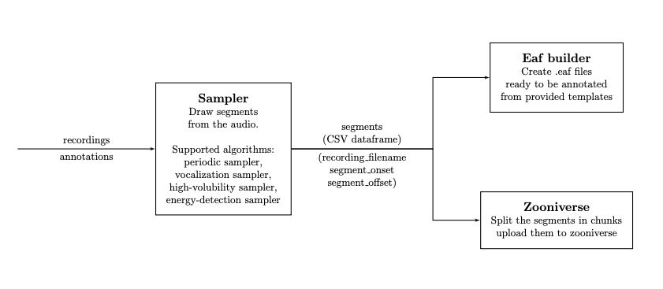

.. _samplers:

Samplers
--------

Overview
~~~~~~~~

   Sampling audio segments to be annotated with ChildProject.

A sampler draws segments from each recording, according to the algorithm and the parameters defined by the user.
The sampler will produce two files into the `destination` folder :

 - `segments_YYYYMMDD_HHMMSS.csv`, a CSV dataframe of all sampled segments, with three columns: ``recording_filename``, ``segment_onset`` and ``segment_offset``.
 - `parameters_YYYYMMDD_HHMMSS.yml`, a Yaml file with all the parameters that were used to generate the samples.

If the folder `destination` does not exist, it is automatically created in the process.

Several samplers are implemented in our package, which are listed below.
The samples can then feed following pipelines such as the :ref:`zooniverse` pipeline.

.. clidoc::

   child-project sampler --help

Periodic sampler
~~~~~~~~~~~~~~~~

Draw segments from the recordings, periodically

.. clidoc::

   child-project sampler /path/to/dataset /path/to/destination periodic --help

Vocalization sampler
~~~~~~~~~~~~~~~~~~~~

Draw segments from the recordings, targetting vocalizations from
specific speaker-type(s).

.. clidoc::

   child-project sampler /path/to/dataset /path/to/destination random-vocalizations --help

Energy-based sampler
~~~~~~~~~~~~~~~~~~~~

Draw segments from the recordings, targetting windows with energies
above some threshold.

.. clidoc::

   child-project sampler /path/to/dataset /path/to/destination energy-detection --help

High-Volubility sampler
~~~~~~~~~~~~~~~~~~~~~~~

(TODO)

.. clidoc::

   child-project sampler /path/to/dataset /path/to/destination high-volubility --help
