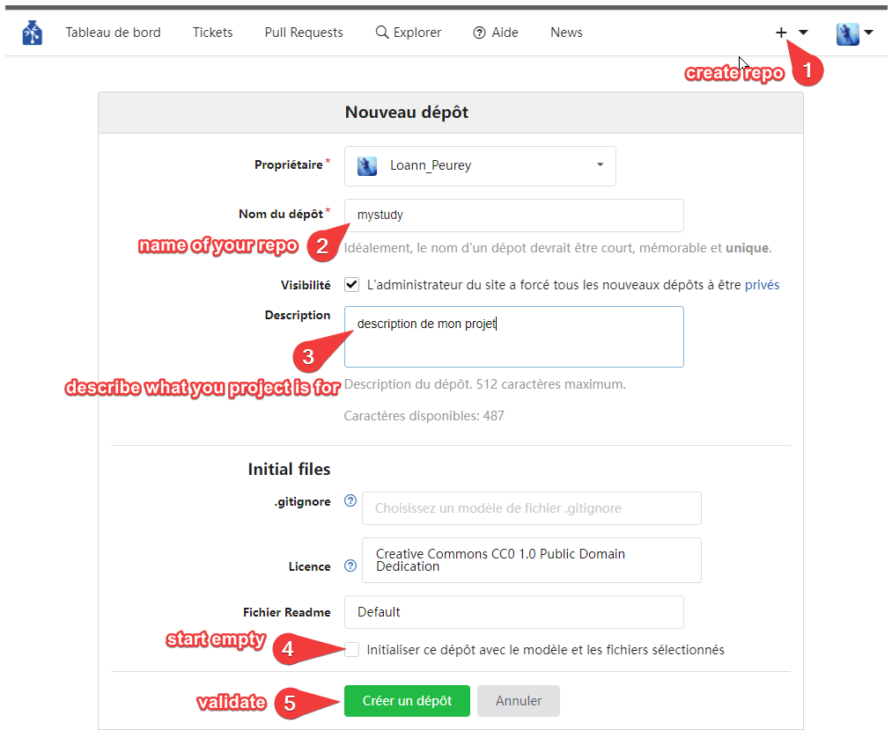

Converting a dataset
====================

This tutorial will guide you through the steps for the conversion of an
existing dataset. We will use the `VanDam-Daylong dataset from
HomeBank <https://homebank.talkbank.org/access/Public/VanDam-Daylong.html>`__
as an example.

This is mainly an introduction to the way ChildProject handles things and how
files are articulated together. If you need to create an entire new dataset, 
consider following our `handbook guide <https://laac-lscp.github.io/docs/create-a-new-dataset.html>`__, 
or making use of our ready to go `datalad procedures <https://github.com/LAAC-LSCP/datalad-procedures>`__ 
to create the base structure and linkage to an online repository.

Set-up datalad and child-project
--------------------------------

Make sure you have followed the :ref:`installation` instructions before proceeding.

Create a dataset
----------------

The first step is to create a new dataset named vandam-data :
To do this, you will need to use a terminal and navigate to the folder you want your dataset created in.
Open your terminal or Anaconda prompt for Windows and activate your childproject environment with ``conda activate childproject`` 
and use the ``cd`` command to navigate to your working directory.
This command will not only create the necessary folders but also the necessary datalad configuration files.

.. tabs::

   .. code-tab:: bash linux/MacOS

      datalad create vandam-data
      cd vandam-data

   .. code-tab:: bat Windows

      datalad create vandam-data
      cd vandam-data

So far, the dataset contains nothing but hidden files:

.. tabs::

   .. group-tab:: linux/MacOS

      .. code-block:: bash

         ls -A

      output::

         .datalad    .git        .gitattributes

   .. group-tab:: Windows

      .. code-block:: bat

         dir /a

      output::

         2011-01-01   04:32 PM     <DIR>            .
         2011-01-01   04:32 PM     <DIR>            ..
         2011-01-01   04:32 PM     <DIR>            .datalad
         2011-01-01   04:32 PM     <DIR>            .git
         2011-01-01   04:32 PM     <DIR>            .gitattributes

Now, we would like to get the data from https://homebank.talkbank.org/access/Public/VanDam-Daylong.html, convert it to our
standards, and then publish it.

Gather and sort the files
-------------------------

The first step is to create the directories:

.. tabs::

   .. code-tab:: bash linux/MacOS

      mkdir metadata # Create the metadata subfolder
      mkdir -p recordings/raw # Create the subfolders for raw recordings
      mkdir annotations # Create the subfolder for annotations
      mkdir extra # Create the subfolder for extra data (that are neither metadata, recordings or annotations)
      touch extra/.gitignore # Make sure the directory is present even though it's empty

   .. code-tab:: bat Windows

      mkdir metadata
      mkdir recordings\raw
      mkdir annotations
      mkdir extra
      type nul >> extra\.gitignore

Then, download the original data-set from HomeBank. You need to identify what key files are necessary for
the dataset. We will get the audio files, the annotation files and some metadata.

The audio first:

.. tabs::

   .. code-tab:: bash linux/MacOS

      curl https://media.talkbank.org/homebank/Public/VanDam-Daylong/BN32/BN32_010007.mp3 -o recordings/raw/BN32_010007.mp3

   .. code-tab:: bat Windows

      curl https://media.talkbank.org/homebank/Public/VanDam-Daylong/BN32/BN32_010007.mp3 -o recordings\raw\BN32_010007.mp3

Now let’s get the annotations.

.. tabs::

   .. code-tab:: bash linux/MacOS

      curl https://homebank.talkbank.org/data/Public/VanDam-Daylong.zip -o VanDam-Daylong.zip
      unzip VanDam-Daylong.zip
      rm VanDam-Daylong.zip # Remove the zip archive

   .. code-tab:: bat Windows

      curl https://homebank.talkbank.org/data/Public/VanDam-Daylong.zip -o VanDam-Daylong.zip
      tar -xf VanDam-Daylong.zip
      del VanDam-Daylong.zip

Let’s explore the contents of VanDam-Daylong:

.. tabs::

   .. group-tab:: linux/MacOS

      .. code-block:: bash

         find . -not -path '*/\.*' -type f -print

      output::

         ./recordings/raw/BN32_010007.mp3
         ./VanDam-Daylong/BN32/0its/e20100728_143446_003489.its
         ./VanDam-Daylong/BN32/BN32_010007.cha
         ./VanDam-Daylong/0metadata.cdc

   .. group-tab:: Windows

      .. code-block:: bat

         where /r VanDam-Daylong *

      output::

         C:\Users\Loann\LAAC\vandam-data\VanDam-Daylong\0metadata.cdc
         C:\Users\Loann\LAAC\vandam-data\VanDam-Daylong\BN32\BN32_010007.cha
         C:\Users\Loann\LAAC\vandam-data\VanDam-Daylong\BN32\0its\e20100728_143446_003489.its

-  ``0metadata.cdc1`` looks like some metadata file, so we will move it
   to ``metadata/`` :

.. tabs::

   .. code-tab:: bash linux/MacOS

      mv VanDam-Daylong/0metadata.cdc metadata/

   .. code-tab:: bat Windows

      move VanDam-Daylong\0metadata.cdc metadata\

-  ``BN32_010007.cha`` contains some transcriptions. Let’s create a set
   of annotations ``cha`` and move it there :

.. tabs::

   .. code-tab:: bash linux/MacOS

      mkdir -p annotations/cha/raw
      mv VanDam-Daylong/BN32/BN32_010007.cha annotations/cha/raw

   .. code-tab:: bat Windows

      mkdir annotations\cha\raw
      move VanDam-Daylong\BN32\BN32_010007.cha annotations\cha\raw

-  ``e20100728_143446_003489.its`` contains diarization and other
   information such as word counts. Let’s create another set of
   annotations for it. And for the sake of consistency, we’ll rename it
   ``BN32_010007.its``.

.. tabs::

   .. code-tab:: bash linux/MacOS

      mkdir -p annotations/its/raw
      mv VanDam-Daylong/BN32/0its/e20100728_143446_003489.its annotations/its/raw/BN32_010007.its

   .. code-tab:: bat Windows

      mkdir annotations\its\raw
      move VanDam-Daylong/BN32\0its\e20100728_143446_003489.its annotations\its\raw\BN32_010007.its

Now we’ve got all the files. Let’s try to run the validation on the
dataset:

.. tabs::

   .. group-tab:: linux/MacOS

      .. code-block:: bash

         child-project validate .

      output::

         Traceback (most recent call last):
            File "/Users/acristia/anaconda3/bin/child-project", line 8, in <module>
               sys.exit(main())
            File "/Users/acristia/anaconda3/lib/python3.7/site-packages/ChildProject/cmdline.py", line 241, in main
               args.func(args)
            File "/Users/acristia/anaconda3/lib/python3.7/site-packages/ChildProject/cmdline.py", line 39, in validate
               errors, warnings = project.validate(args.ignore_files)
            File "/Users/acristia/anaconda3/lib/python3.7/site-packages/ChildProject/projects.py", line 102, in validate
               self.read()
            File "/Users/acristia/anaconda3/lib/python3.7/site-packages/ChildProject/projects.py", line 86, in read
               self.children = self.ct.read(lookup_extensions = ['.csv', '.xls', '.xlsx'])
            File "/Users/acristia/anaconda3/lib/python3.7/site-packages/ChildProject/tables.py", line 65, in read
               raise Exception("could not find table '{}'".format(self.path))
            Exception: could not find table './metadata/children'

   .. group-tab:: Windows

      .. code-block:: bat

         child-project validate .

      output::

         Traceback (most recent call last):
            File "C:\Users\acristia\anaconda3\bin\child-project", line 8, in <module>
               sys.exit(main())
            File "C:\Users\acristia\anaconda3\lib\python3.7\site-packages\ChildProject\cmdline.py", line 241, in main
               args.func(args)
            File "C:\Users\acristia\anaconda3\lib\python3.7\site-packages\ChildProject\cmdline.py", line 39, in validate
               errors, warnings = project.validate(args.ignore_files)
            File "C:\Users\acristia\anaconda3\lib\python3.7\site-packages\ChildProject\projects.py", line 102, in validate
               self.read()
            File "C:\Users\acristia\anaconda3\lib\python3.7\site-packages\ChildProject\projects.py", line 86, in read
               self.children = self.ct.read(lookup_extensions = ['.csv', '.xls', '.xlsx'])
            File "C:\Users\acristia\anaconda3\lib\python3.7\site-packages\ChildProject\tables.py", line 65, in read
               raise Exception("could not find table '{}'".format(self.path))
            Exception: could not find table '.\metadata\children'

This is expected. The validation should fail, because the metadata is missing. We need to store
the metadata about the children and the recordings in a way that meets
the specifications (see :ref:`format-metadata`).

Create the metadata
-------------------

We need two metadata files:

 - ``metadata/recordings.csv``, which links each recording to their associate metadata
     (recording date and time, recording device, etc.)
 - ``metadata/children.csv``, which stores the information about the participants.

Let’s start with the recordings metadata. ``metadata/recordings.csv``
should at least have the following columns: experiment, child_id,
date_iso, start_time, recording_device_type, recording_filename. The .its file
contains (``annotations/its/raw/BN32_010007.its``) precious information
about when the recording started:

.. code:: xml

   <Recording num="1" startClockTime="2010-07-24T11:58:16Z" endClockTime="2010-07-25T01:59:20Z" startTime="PT0.00S" endTime="PT50464.24S">

The 'Z' suffix in the clock times indicate they correspond to the UTC timezone.
However, the metadata should contain local times only. The difference between
the two is 5 hours, according to the following line in the .its file:

.. code:: xml

   <TransferTime LocalTime="2010-07-28T14:34:46" TimeZone="CST" UTCTime="2010-07-28T19:34:46" />

Therefore, the recording started on 2010-07-24, at 06:58 (local time).

In order to reflect that information, the recordings CSV metadata
should look like this (we have decided that the only child of the
dataset should have ID ‘1’):

.. csv-table:: Recordings metadata
      :header-rows: 1
      :file: _static/vandam/recordings.csv

We have prepared it for you. Download ``recordings.csv`` :download:`here <_static/vandam/recordings.csv>`,
and save it in the ``metadata`` subfolder of your dataset.
You can check its content by issuing the following command:

.. tabs::

   .. group-tab:: linux/MacOS

      .. code-block:: bash

         cat metadata/recordings.csv

      output::

         experiment,child_id,date_iso,start_time,recording_device_type,recording_filename
         vandam-daylong,1,2010-07-24,11:58,lena,BN32_010007.mp3

   .. group-tab:: Windows

      .. code-block:: bat

         type metadata\recordings.csv

      output::

         experiment,child_id,date_iso,start_time,recording_device_type,recording_filename
         vandam-daylong,1,2010-07-24,11:58,lena,BN32_010007.mp3

Now, let us proceed to the children metadata.
The only fields that are required are:
experiment, child_id and child_dob. The .its file also contains some
information about the child:

.. code:: xml

   <ChildInfo algorithmAge="P12M" gender="F" />

She was a 12 month old girl at the time of the recording. We can thus
assign her a calculated date of birth: 2009-07-24. We will set
``dob_criterion`` to “extrapolated” to keep track of the fact that the
date of birth was calculated from the approximate age at recording. We
will also set ``dob_accuracy`` to ‘month’ for that child.

In other words, the children metadata CSV file should look like this:

.. csv-table:: Children metadata
      :header-rows: 1
      :file: _static/vandam/children.csv

We have prepared it for you. Download ``children.csv`` :download:`here <_static/vandam/children.csv>`,
and save it in the ``metadata`` subfolder of your dataset.
You can check its content by issuing the following command:

.. tabs::

   .. group-tab:: linux/MacOS

      .. code-block:: bash

         cat metadata/children.csv

      output::

         experiment,child_id,child_dob,dob_criterion,dob_accuracy
         vandam-daylong,1,2009-07-24,extrapolated,month

   .. group-tab:: Windows

      .. code-block:: bat

         type metadata\children.csv

      output::

         experiment,child_id,child_dob,dob_criterion,dob_accuracy
         vandam-daylong,1,2009-07-24,extrapolated,month

We can now make sure that they are no errors by running the validation
command again:

.. tabs::

   .. code-tab:: bash linux/MacOS

      child-project validate .

   .. code-tab:: bat Windows

      child-project validate .

No error occurs.

.. note::

   The metadata can be enriched with many more columns.
   See :ref:`format-metadata` for standard columns.
   You can add as many extra, custom columns as you need.

Save the changes locally
------------------------

A DataLad dataset is essentially a git repository, with the large files
being handled by git-annex. Some of the files (usually the small, text
files such as metadata and scripts) ought to be versionned with git, and
the larger files or binary files should be stored in the *annex*.

The rules to decide what files should be stored which way can be set in
the ``.gitattributes`` file. You should fill it by running the following
lines:

.. tabs::

   .. code-tab:: bash linux/MacOS

      echo "* annex.backend=MD5E" >.gitattributes
      echo "**/.git* annex.largefiles=nothing" >>.gitattributes
      echo "scripts/* annex.largefiles=nothing" >>.gitattributes
      echo "metadata/* annex.largefiles=nothing" >>.gitattributes
      echo "recordings/converted/* annex.largefiles=((mimeencoding=binary))" >>.gitattributes

   .. code-tab:: bat Windows

      echo "* annex.backend=MD5E" >.gitattributes
      echo "**/.git* annex.largefiles=nothing" >>.gitattributes
      echo "scripts/* annex.largefiles=nothing" >>.gitattributes
      echo "metadata/* annex.largefiles=nothing" >>.gitattributes
      echo "recordings/converted/* annex.largefiles=((mimeencoding=binary))" >>.gitattributes

Check the content by running:

.. tabs::

   .. group-tab:: linux/MacOS

      .. code-block:: bash

         cat .gitattributes

      output::

         * annex.backend=MD5E
         **/.git* annex.largefiles=nothing
         scripts/* annex.largefiles=nothing
         metadata/* annex.largefiles=nothing
         recordings/converted/* annex.largefiles=((mimeencoding=binary))

   .. group-tab:: Windows

      .. code-block:: bat

         type .gitattributes

      output::

         * annex.backend=MD5E
         **/.git* annex.largefiles=nothing
         scripts/* annex.largefiles=nothing
         metadata/* annex.largefiles=nothing
         recordings/converted/* annex.largefiles=((mimeencoding=binary))

These rules will version all the files under ``scripts/`` and
``metadata/``, as well as the text files inside of
``recordings/converted/``. By default, the other files will be put in
the annex.

The changes can now be saved. This can be done with `datalad
save <http://docs.datalad.org/en/stable/generated/man/datalad-save.html>`__.
``datalad save`` is equivalent to a combination of ``git add`` and
``git commit`` in one go. It decides, based on the rules in
``.gitattributes``, whether to store files with git or git-annex.

.. tabs::
   .. code-tab:: bash linux/MacOS

      datalad save . -m "first commit"

   .. code-tab:: bat Windows

      datalad save . -m "first commit"

However, so far, your changes remain local, and your dataset still needs
to be published into a *sibling* to be shared with others.

Processing
----------

You can do some processing on the dataset. For instance, you can compute
the duration of the recording, and update the metadata with this
information. This is easily done with:

.. tabs::

   .. code-tab:: bash linux/MacOS

      child-project compute-durations .

   .. code-tab:: bat Windows

      child-project compute-durations .

.. warning::

   We are currently aware of a problem with the ``compute-duration`` command on Windows systems, it is likely this will fail for now.

Now ``metadata/recordings.csv`` became:

.. tabs::

   .. group-tab:: linux/MacOS

      .. code-block:: bash

         cat metadata/recordings.csv

      output::

         experiment,child_id,date_iso,start_time,recording_device_type,recording_filename,duration
         vandam-daylong,1,2010-07-24,11:58,lena,BN32_010007.mp3,50464512

   .. group-tab:: Windows

      .. code-block:: bat

         type metadata\recordings.csv

      output::

         experiment,child_id,date_iso,start_time,recording_device_type,recording_filename,duration
         vandam-daylong,1,2010-07-24,11:58,lena,BN32_010007.mp3,50464512

You can also convert and index the its annotation:

.. tabs::
   .. code-tab:: bash linux/MacOS

      child-project import-annotations . --set its \
         --recording_filename BN32_010007.mp3 \
         --time_seek 0 \
         --range_onset 0 \
         --range_offset 50464512 \
         --raw_filename BN32_010007.its \
         --format its

   .. code-tab:: bat Windows

      child-project import-annotations . --set its ^
         --recording_filename BN32_010007.mp3 ^
         --time_seek 0 ^
         --range_onset 0 ^
         --range_offset 50464512 ^
         --raw_filename BN32_010007.its ^
         --format its

And save the changes again:

.. tabs::
   .. code-tab:: bash linux/MacOS

      datalad save . -m "its"

   .. code-tab:: bat Windows

      datalad save . -m "its"

Publish the dataset
-------------------

Where to publish my dataset ?
~~~~~~~~~~~~~~~~~~~~~~~~~~~~~

DataLad allows you to publish your datasets on `large number of storage
providers <https://git-annex.branchable.com/special_remotes/>`_,
including Amazon S3, Dropbox, Google Cloud Storage, Microsoft Azure Blob
Storage, etc.,
each having their own advantages and limitations. It is also
possible to publish to several platforms, as we do with our own
datasets.

The table below summarises the features of a few storage supports. The
solutions described here are by no mean exhaustive, but they are easy to
generalize.

-  Platforms that support Git store the .git files and will allow you to
   clone the datasets from them with ``datalad install``
-  Platforms that support Large Files will allow you to store and
   distribute the large or binary files that are stored with git-annex
   instead of the regular git files (such as scripts and metadata)

It is necessary to use a platform or a combination of platforms that
supports both. We recommend the use of `GIN <https://gin.g-node.org/>`_,
although you should always push your data to another platform as backup.

.. csv-table::
   :header-rows: 1

   Provider,Git,Large Files,Authentication,Permissions,Cost,Quota
   GIN,Yes,Yes,HTTPS/SSH,ACL,Free below ~10 TB,None
   SSH server,Yes,Yes,SSH,Unix,\-,None
   GitHub,Yes,No,HTTPS/SSH,ACL,Free,~1 GB
   GitLab,Yes,No,HTTPS/SSH,ACL,Free,~1 GB
   Amazon S3,No,Yes,API,IAM,~4$/TB/month,None
   Nextcloud,No,Yes,WebDav,ACL,\-,None
   OSF.io,Yes,Yes*,Token,ACL,Free,5 GB

.. note::

   DataLad uses git-annex, which naturally handles `encryption <https://git-annex.branchable.com/encryption>`_.
   This is particularly useful when using third-party providers
   such as Amazon S3.
   

Publish to GIN
~~~~~~~~~~~~~~

.. note::
   
   Before anything, you will need to create an account on `GIN <https://gin.g-node.org/>`_,
   and to link your `SSH public key <https://childproject.readthedocs.io/en/latest/reuse.html?highlight=ssh#setup-your-gin-account>`_ to your
   GIN account.

1. Create a new repository from `GIN's web interface <https://gin.g-node.org/repo/create>`_. Uncheck "Initialize this repository with selected files and template"

   creating a repository on GIN

2. Copy the SSH url of your repository to your clipboard, e.g.: ``git@gin.g-node.org:/<username>/<reponame>.git``
3. Add a datalad sibling pointing to this repository:

.. code:: bash
   
   datalad siblings add \
      --name gin \
      --url git@gin.g-node.org:/<username>/<reponame>.git

4. Push the data to GIN:

.. code:: bash

   datalad push --to gin

Publish to a SSH server
~~~~~~~~~~~~~~~~~~~~~~~

If you have access to a SSH server with enough storage capacity, you can
use it to store and share the dataset. This is done with the `datalad
create-sibling <http://docs.datalad.org/en/stable/generated/man/datalad-create-sibling.html>`__
command:

.. code:: bash

   datalad create-sibling [-h] [-s [NAME]] [--target-dir PATH] [--target-url URL] [--target-pushurl URL] [--dataset DATASET] [-r] [-R LEVELS] [--existing MODE] [--shared {false|true|umask|group|all|world|everybody|0xxx}] [--group GROUP] [--ui {false|true|html_filename}] [--as-common-datasrc NAME] [--publish-by-default REFSPEC] [--publish-depends SIBLINGNAME] [--annex-wanted EXPR] [--annex-group EXPR] [--annex-groupwanted EXPR] [--inherit] [--since SINCE] [SSHURL]

For instance, you can create it (this is only to be done once) by
issuing:

.. code:: bash

   datalad create-sibling -s cluster --annex-wanted 'include=*' <ssh-server>:/remote/path/to/the/dataset

``cluster`` is the name of the sibling, and
``<ssh-server>:/remote/path/to/the/dataset`` is the SSH url of its
destination. ``--annex-wanted 'include=*'`` implies that all large files
will be published to this sibling by default.

Once the sibling has been created, the changes can be published:

.. code:: bash

   datalad push --to cluster

That’s it! People can now get your data from:

.. code:: bash

   datalad install <ssh-server>:/remote/path/to/the/dataset

If ``--annex-wanted`` had not been set to ``'include=*'``, the large
files (i.e. annexed files) would not be published unless you asked for
it explicitly with the ``--data`` flag:

.. code:: bash

   datalad push --to cluster --data anything

Publish to GitHub
~~~~~~~~~~~~~~~~~

You first need to create the repository, which can be done in a
straightforward way from the command line with `datalad
create-sibling-github <http://docs.datalad.org/en/stable/generated/man/datalad-create-sibling-github.html>`__:

.. code:: bash

   datalad create-sibling-github [-h] [--dataset DATASET] [-r] [-R LEVELS] [-s NAME] [--existing MODE] [--github-login NAME] [--github-organization NAME] [--access-protocol {https|ssh}] [--publish-depends SIBLINGNAME] [--private] [--dryrun] REPONAME

For instance:

.. code:: bash

   datalad create-sibling-github -s origin --access-protocol ssh vandam-daylong-demo

``origin`` will be the local name of the sibling, and
``vandam-daylong-demo`` the name of the GitHub repository. Once the
sibling has been created, you can publish the changes with `datalad
push <http://docs.datalad.org/en/stable/generated/man/datalad-push.html>`__:

.. code:: bash

   datalad push --to origin

You should get a repository identical to `this
one <https://github.com/LAAC-LSCP/vandam-daylong-demo>`__.

Users can now install your dataset from GitHub:

.. code:: bash

   datalad install https://github.com/LAAC-LSCP/vandam-daylong-demo.git

PS: we recommend that you do ``git push --set-upstream origin`` to set
upstream to the GitHub sibling. Users who install your dataset from GitHub will not
need to do this.

GitHub + SSH mirror to store the large files
^^^^^^^^^^^^^^^^^^^^^^^^^^^^^^^^^^^^^^^^^^^^

Now, let’s assume you have already created a SSH sibling as well for
your dataset, and that it is named ``cluster``. You can make sure that
all changes to ``github`` are published to ``cluster`` as well, by
setting the ``publish-depends`` property of the github sibling:

.. code:: bash

   datalad siblings configure -s origin --publish-depends cluster

Now, ``datalad push --to origin`` will publish the changes to both
``cluster`` and ``github``.

However, when the users install your dataset from GitHub, they will not
have access to the ``cluster`` sibling unless you make it available to
them, which can be done this way :

.. code:: bash

   git annex 
   git annex initremote cluster type=git location=ssh://cluster.com/path/to/the/repository autoenable=true
   git annex enableremote cluster
   git remote add origin git@github.com:LAAC-LSCP/vandam-daylong-demo.git

Publish on S3
~~~~~~~~~~~~~

Like other *git annex special remotes*, Amazon S3 will not support the
git files, only the large files. It could be used together win GitHub
as the primary host for your large files, or as a backup. 

*For the sake of simplicity, we will not use encryption here, but git
annex implements several*\ `encryption
schemes <https://git-annex.branchable.com/encryption/>`__\ *which are
easy to use.*

First, store your AWS credentiels into your environment variables, like
this:

.. code:: bash

   export AWS_ACCESS_KEY_ID="08TJMT99S3511WOZEP91"
   export AWS_SECRET_ACCESS_KEY="s3kr1t"

You are now readyto create the s3 sibling. This is done directly through
git-annex this time:

.. code:: bash

   git annex initremote s3 chunk=100MiB type=S3 encryption=none datacenter=eu-west-3 embedcreds=no signature=v4

You can now publish the data with:

.. code:: bash

   datalad push --to s3 --data anything

(Optional) You can set the S3 sibling to require that all large files
should be stored on it:

.. code:: bash

   datalad siblings configure -s s3 --annex-wanted 'include=*'

This will let DataLad publish all the large files automatically without
setting ``--data``:

.. code:: bash

   datalad push --to s3

Let’s assume your users will install the dataset from a GitHub
repository. You should publish the information about the newly created
S3 sibling on GitHub, which can be done with (provided you have set up
your GitHub repository as described in the previous section):

.. code:: bash

   datalad push --to github

Now, users will be able to get the data by issuing the following
commands:

.. code:: bash

   datalad install git@github.com:<your-username>/vandam-daylong-demo.git
   git annex enableremote s3
   datalad get *

With this configuration, they will need to setup their AWS credentials
as you did. `But it is possible to configure the sibling so that the
credentials are
encrypted <https://git-annex.branchable.com/tips/using_Amazon_S3/>`__
and stored in the repository, so all users with authorized private keys
will be able to get the data without this step.

Publish on OSF
~~~~~~~~~~~~~~

DataLad has an
`extension <http://docs.datalad.org/projects/osf/en/latest/generated/man/datalad-create-sibling-osf.html>`__
to publish data on the `Open Science Framework <https://osf.io/>`__.

This extension supports the following modes:

.. csv-table:: datalad create-sibling-osf modes
   :header-rows: 1

   Mode,datalad install,large files,history,older files,human-readable project
   ``annex``,Yes,Yes,Yes,Yes,No
   ``export``,Yes,Yes,Yes,No,Yes
   ``gitonly``,Yes,No,Yes,No,No
   ``export-only``,No,Yes,No,Yes,Yes

The first step is to install the extension:

.. code:: bash

   pip install datalad-osf --upgrade

We decide to use the ``export`` mode - but you can decide which best
suits your needs from the table above. We can now create the sibling:

.. code:: bash

   datalad create-sibling-osf --title "VanDam Demo" \
     --mode export \
     -s osf \
     --category data \
     --tag reproducibility \
     --public

You will be prompted your credentials in the process, which will require
access tokens to be created `from your osf.io
account <https://osf.io/settings/tokens>`__.

And finally we can push the data. This is done in two steps:

1. publishing the .git files so people can clone the dataset directly
   from OSF

.. code:: bash

   datalad push --to osf

2. exporting a human-readable snapshot of the files to OSF

.. code:: bash

   git-annex export HEAD --to osf-storage
